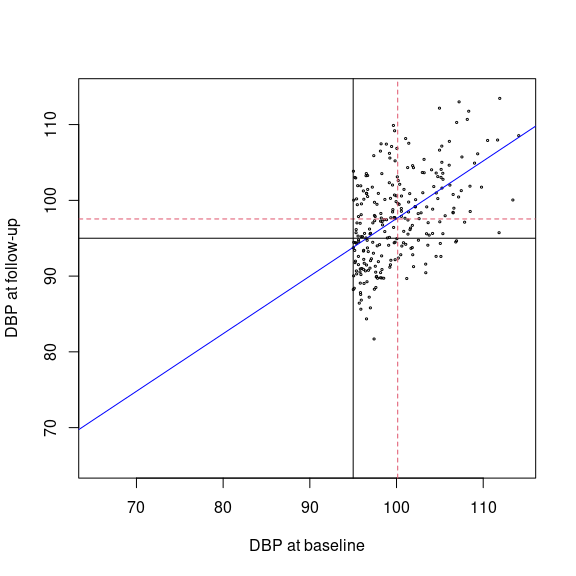

<!-- README.md is generated from README.Rmd. Please edit that file -->

# RegToMeanExample

<!-- badges: start -->

<!-- badges: end -->

The goal of RegToMeanExample is the visualisation of Regression to the
Mean

## Installation

You can install the development version of RegToMeanExample from
[GitHub](https://github.com/) with:

``` r
# install.packages("devtools")
devtools::install_github("mcdr65/RegToMeanExample")
```

## Example

You can load the package and play with the main (and the only) function:

``` r
library(RegToMeanExample)
args(DBP.RTM)
#> function (mu = 90, sigma = 8, r = 0.76, n = 1000, limit = 95, 
#>     TrueChange = 0, show.plot = TRUE, show.out = FALSE) 
#> NULL
DBP.RTM()
```


